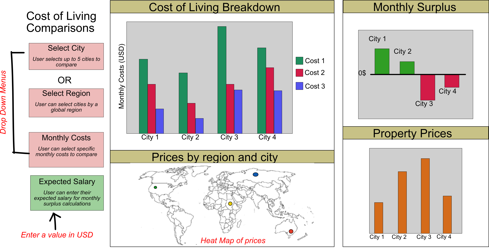

# Exploring the cost of living
- authors: Affrin Sultana, Arushi Ahuja, Jiwei Hu, Margot Vore

This python-based [dashboard](https://cost-of-living-comparison.herokuapp.com/) is designed to help new college graduates explore the cost of living in different major cities around the world.Our dashboard aims to ease the decision making for the last factor mentioned.In this project , we are using the **Cost of Living - NUMBEO Dataset** which is avaialable in [Kaggle](https://www.kaggle.com/joeypp/cost-of-living-numbeo-dataset).
More details about the usage of this dashboard can be found in the [proposal document](https://github.com/UBC-MDS/Cost_of_living_py/blob/main/Proposal.md).

# Our Motivation
Students completing their degree spend the last 3 to 4 months of their last semester wondering: what next? Students who are looking to work after graduating especially have questions about the current job market, companies and whether they will be able to afford moving to a new country or city for a job. There should be a one stop solution where in these users(graduationg students) can simply key in the desired city or region and estimated income which would give them information about the cost of living as well as the expected savings per month to help them plan better.
# Our Solution
 We have designed an interactive dashboard to give the users flexibility to compare the breakdown of monthly expense from different cities using a series of drop-down menus. We are planning on providing 4 different menus for the users to explore. The first menu allows the user to pick up to 6 different global cities to compare living expenses across, with all expenses shown in USD regardless of the location. If the user is unsure what cities they are interested in but want to explore a given region of the world, drop down menu two will allow users to select a global region, which will display all cities within the selected area. The third drop down menu allows the user to select a subset of monthly expenses to explore from average rent prices and monthly food expenditures and a range of other expenses. Finally, the user will be able to enter their expected salary in order to compare how their monthly wages will compare to their monthly expenditures.
# Description of the Dashboard

We have created 4 different visualizations within the dashboard. 
* The first plot is a bar chart that shows the breakdown of monthly expenses per city selected by the user. 
* The second chart shows the surplus or deficit of living in each selected city, considering all monthly expenses and the users expected salary.
*  The third plot shows the prices of buying a property 
*  The fourth plot is a geospatial representation which depicts desired living expenses in cities of interest.

Following actions can be performed on our dashboard :

* Select the expense from a range of options.
* Filter the visualizations based on a desired city/cities of interest from the dropdown.
* Filter the visualizations based on a desired region of interest from the dropdown.
* Enter the expected monthly salary in USD to get an estimate of the savings.

Our dashboard can be accessed [here](https://cost-of-living-comparison.herokuapp.com/)
<br>
<br>
<br>


# Installation Guide

To install the dashboard and run it locally,follow the steps below:

Run the following command at the root directory of the project:
```
# clone the repo to your local
git clone https://github.com/UBC-MDS/Cost_of_living_py.git

# change directory to your local repository
cd Cost_of_living_py
# Install all dependencies
pip install -r requirements.txt
# Run the dashboard
python src/cost_of_living_app.py
```
The dashboard can be accessed locally in localhost:8050.

# Contributing
Interested in contributing? Check out the contributing guidelines. Please note that this project is released with a [Code of Conduct](https://github.com/UBC-MDS/Cost_of_living_py/blob/main/CODE_OF_CONDUCT.md). Any feedback or enhancements are welcome.Please check out our [contributing guidelines](https://github.com/UBC-MDS/Cost_of_living_py/blob/main/CONTRIBUTING.md).By contributing to this project, you agree to abide by its terms.

The following softwares were used for the creation and deployment of this dashboard. To learn more about them, please vist:

* [Dash Python User Guide](https://dash.plotly.com/)
* [Dash interactive visualization](https://dash.plotly.com/interactive-graphing)
* [Altair documentation](https://altair-viz.github.io/index.html)
* [Deploying Dash (on Heroku)](https://dash.plotly.com/deployment)
# License
`cost-of-living-comparison` dashboard was created by Affrin Sultana, Arushi Ahuja, Jiwei Hu, Margot Vore. It is licensed under the terms of the MIT license.

#  Credits
The raw data for `cost-of-living-comparison` dashboard was sourced from this [Kaggle dataset](https://www.kaggle.com/joeypp/cost-of-living-numbeo-dataset)
